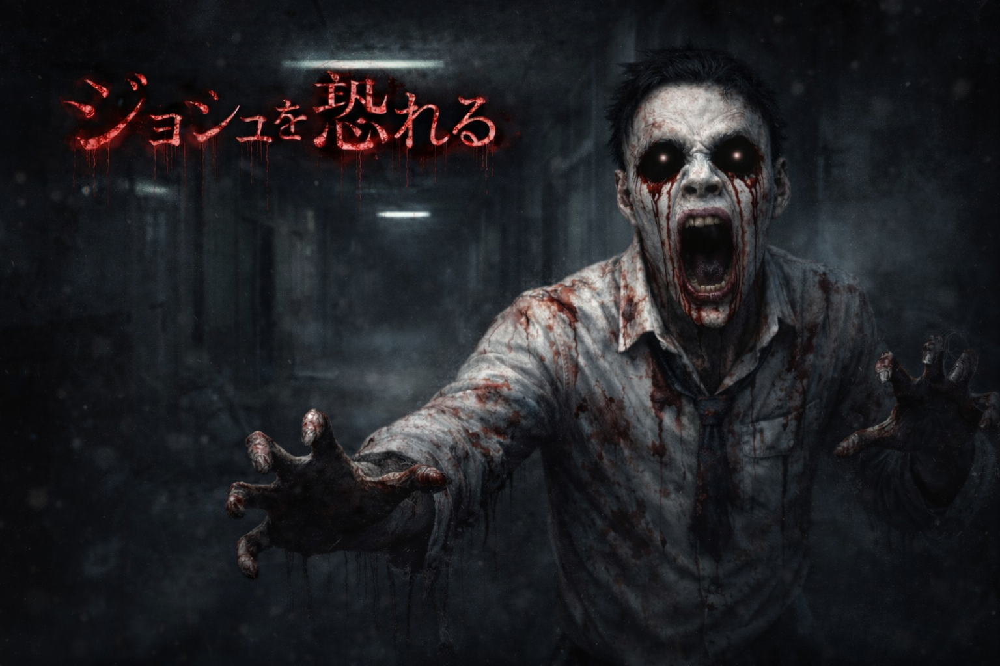
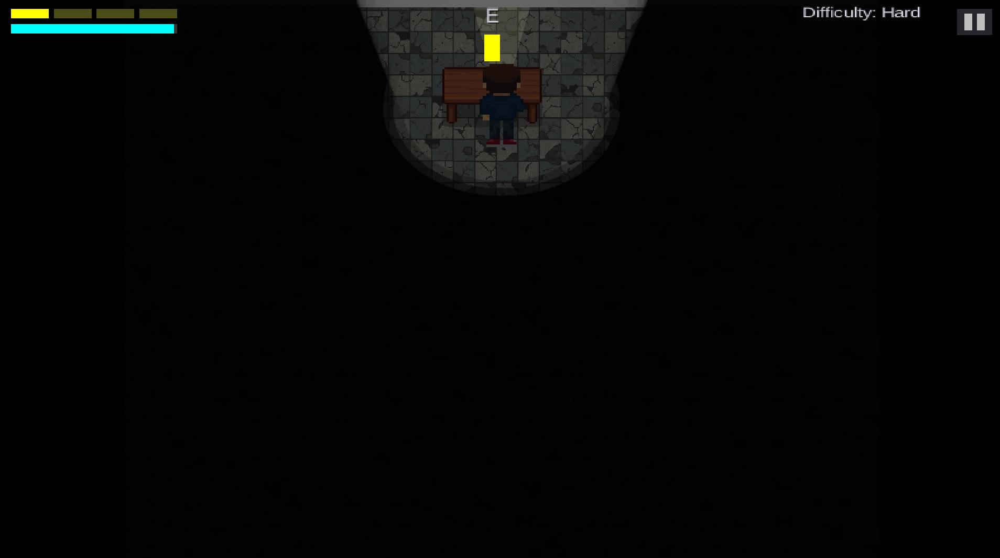
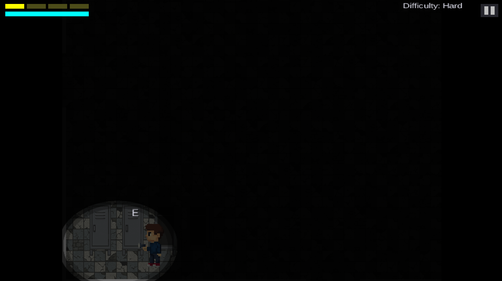
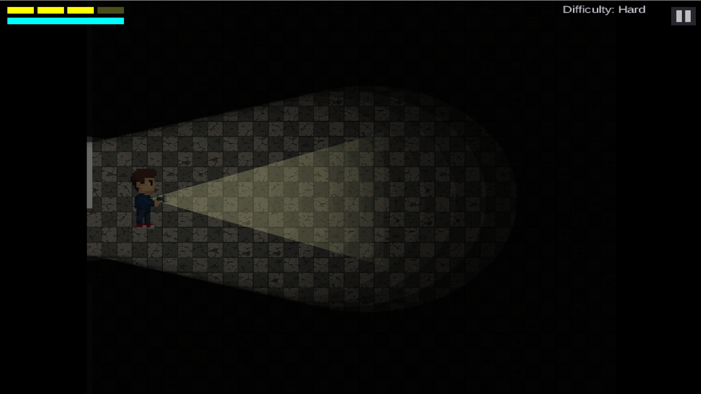

# FEAR JOSH
## 「ジョシュを恐れる」 — Game Horor Survival Psikologis

<!-- HERO IMAGE -->

  

Sebuah game horor psikologis berbasis narasi yang berlatar di sebuah sekolah menengah yang disegel, mengeksplorasi trauma, bullying, dan konsekuensi emosional yang tidak dapat dihindari akibat penekanan perasaan.

---

## Daftar Isi
- [Gambaran Umum](#gambaran-umum)
- [Cerita](#cerita)
- [Gameplay](#gameplay)
- [Kontrol](#kontrol)
- [Tujuan](#tujuan)
- [Ending](#ending)
- [Tingkat Kesulitan](#tingkat-kesulitan)
- [Screenshot](#screenshot)
- [Tim Pengembang](#tim-pengembang)
- [Peringatan Konten](#peringatan-konten)
- [Status Proyek](#status-proyek)
- [Kredit](#kredit)

---

## Gambaran Umum

**FEAR JOSH** adalah game horor survival psikologis di mana pemain menjelajahi sebuah sekolah yang telah disegel sebagai Tempat Kejadian Perkara (TKP) aktif. Bangunan tersebut menyimpan tragedi yang terjadi pada malam kelulusan — dan sesuatu masih berada di dalamnya.

Pemain harus bertahan hidup dengan mengelola sumber daya yang terbatas, menghindari entitas yang terus memburu, serta mengungkap potongan-potongan kebenaran yang terkubur.

---

## Cerita

### Tragedi “Malam Kelulusan”

Josh adalah seorang siswa yang selama bertahun-tahun mengalami bullying. Ia memendam rasa sakit emosional yang mendalam, namun berbeda dengan rumor yang menyebar setelah kejadian, **Josh tidak pernah berniat membakar sekolah**.

Pada malam pesta kelulusan di Aula Besar, di tengah perayaan dan ejekan yang masih ia terima, tubuh Josh bereaksi terhadap tekanan emosional yang tak lagi tertahankan.

Ia tidak menangis.  
Ia berubah.

### Kronologi Kejadian
- Pesta kelulusan berlangsung di Aula Besar
- Josh tiba-tiba terjatuh dan mengalami kejang
- Tubuhnya bermutasi menjadi sosok mengerikan
- Aula hancur akibat amukan fisik, bukan api
- Banyak korban berjatuhan; sebagian berhasil melarikan diri
- Polisi mengepung sekolah, namun senjata tidak efektif
- Bangunan disegel total dan dinyatakan sebagai TKP aktif

### Status Saat Ini
Sekolah masih disegel di balik garis polisi.  
Josh masih terperangkap di dalam — sendirian, dalam wujud monsternya.

---

## Gameplay

### Mekanisme Utama
- **Sistem Flashlight**  
  Menerangi area gelap dan men-stun Josh untuk sementara

- **Sistem Stamina dan Sprint**  
  Berlari untuk melarikan diri dengan stamina yang terbatas

- **Manajemen Baterai**  
  Baterai terbatas dan harus dikelola dengan hati-hati

- **Narasi Berbasis Cutscene**  
  Cerita emosional yang berfokus pada ikatan kakak-adik

- **Multiple Ending**  
  Pilihan pemain menentukan hasil akhir cerita

---

## Kontrol

| Tombol | Fungsi |
|------|------|
| W | Bergerak ke atas |
| A | Bergerak ke kiri |
| S | Bergerak ke bawah |
| D | Bergerak ke kanan |
| Shift | Sprint (menguras stamina) |
| F | Toggle flashlight |
| E | Interaksi |
| Space | Minigame meloloskan diri (saat tertangkap) |
| ESC | Menu pause |

---

## Tujuan

- Menjelajahi sekolah yang telah disegel
- Menghindari Josh saat menavigasi lorong-lorong gelap
- Menemukan peta sekolah untuk mencari jalan keluar
- Mengumpulkan item penting:
  - Fragmen Kunci
  - Cokelat
  - Baterai
- Melarikan diri dari sekolah

---

## Ending

Game ini memiliki beberapa ending yang ditentukan oleh tindakan pemain:

- **Bad Ending** — Gagal mengungkap kebenaran
- **Good Ending** — Penyelesaian sebagian
- **True Ending** — Penutupan cerita secara utuh

---

## Tingkat Kesulitan

- Easy  
- Medium  
- Hard  

Tingkat kesulitan memengaruhi perilaku musuh, konsumsi stamina, dan ketersediaan item.

---

## Screenshot

<!-- TAMBAHKAN GAMBAR GAMEPLAY DI SINI -->

  
  
  

---

## Tim Pengembang

| Nama | Peran |
|----|----|
| Jonathan Christoper | Game Designer |
| Joshua Riangkamang | Programmer |
| Otniel Kristian | Programmer / Level Designer |
| Aridho Caesar | Artist / Asset Designer |

---

## Peringatan Konten

Game ini mengandung tema bullying, kekerasan, horor psikologis, dan visual yang mengganggu.  
Disarankan untuk audiens dewasa.

---

## Status Proyek

Status saat ini: **PANIC**

---

## Kredit

Dikembangkan oleh tim **FEAR JOSH**.  
Terima kasih telah mengalami cerita di balik Malam Kelulusan.
